# Kết quả thực hành

## 1. Bài 1

<table>
  <tr>
    <td align="center" colspan="2">
      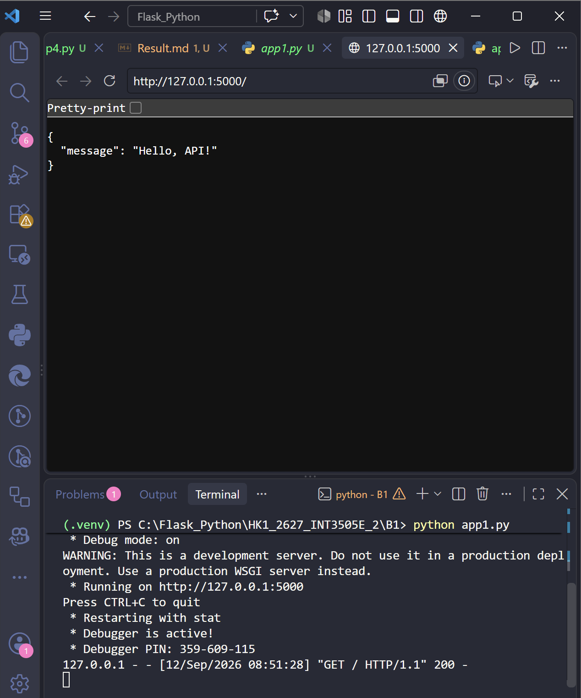
    </td>
  </tr>
  <tr>
    <td colspan="2">
      <b>📝 Giải thích:</b> 
      API Flask chạy thành công tại <code>http://127.0.0.1:5000/</code>.
      Trả về JSON <code>{"message": "Hello, API!"}</code>
      với mã trạng thái <code>200</code>.
    </td>
  </tr>
</table>

---

## 2. Bài 2

<table>
  <tr>
    <td align="center">
      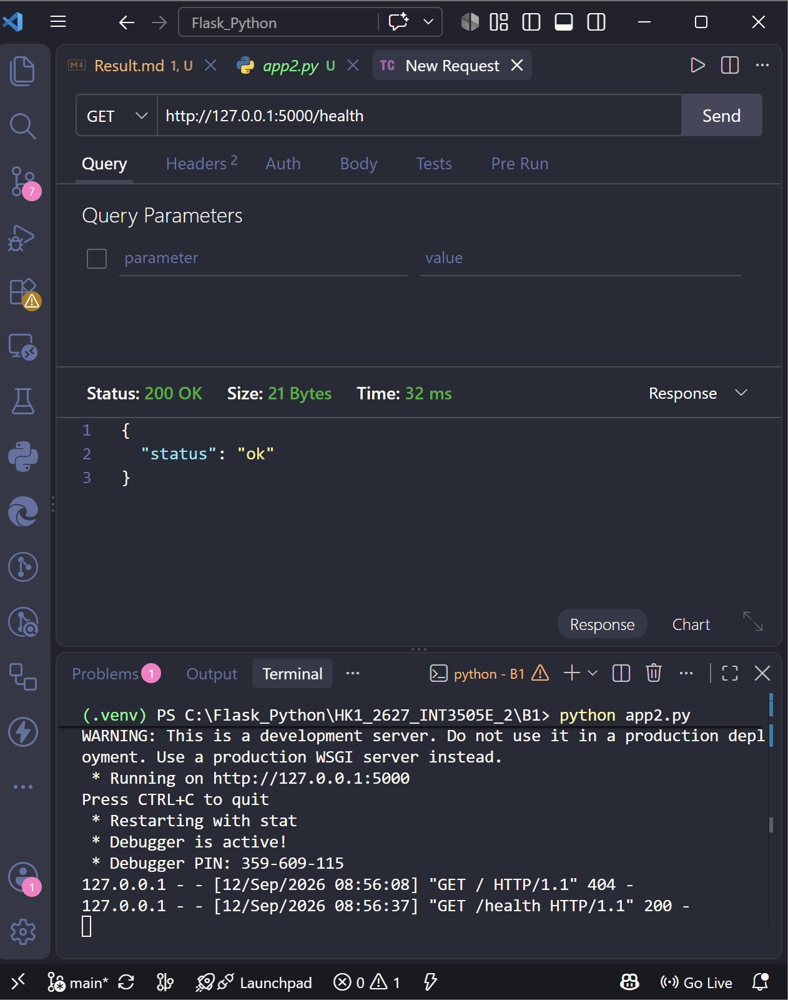
    </td>
    <td align="center">
      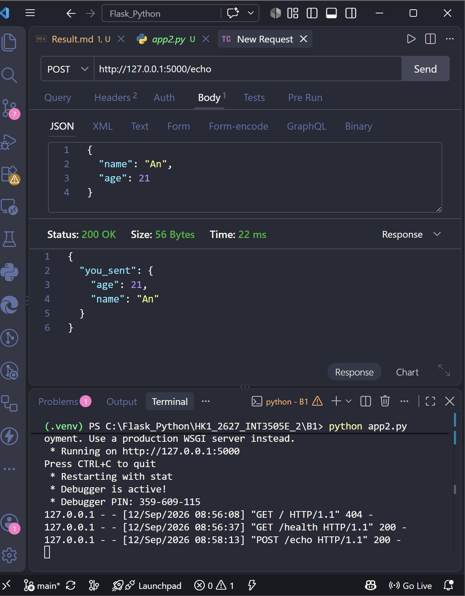
    </td>
  </tr>
  <tr>
    <td width="50%">
      <b>📝 Giải thích ảnh 1:</b> 
      Sử dụng Thunder Client trong VSC. Request <code>GET /health</code> thành công, response trả về mã <code>200 OK</code> với thông báo <code>"ok"</code>.
    </td>
    <td width="50%">
      <b>📝 Giải thích ảnh 2:</b> 
      Request <code>POST /echo</code> thành công, dữ liệu bao gồm <code>name</code> và <code>age</code> duới dạng JSON, API trả lại dữ liệu JSON đã nhận với mã <code>200 OK</code>.
    </td>
  </tr>
</table>

---

## 3. Bài 3

<table>
  <tr>
    <td align="center">
      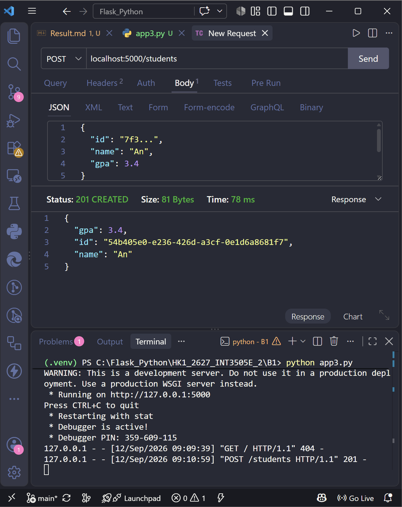
    </td>
    <td align="center">
      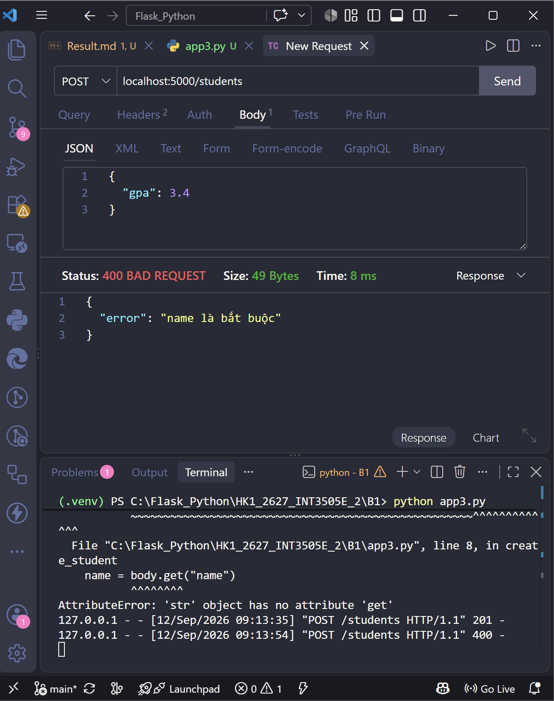
    </td>
  </tr>
  <tr>
    <td width="50%">
      <b>📝 Giải thích ảnh 1:</b> 
      Request <code>POST /students</code> chứa <code>name</code> và <code>gpa</code> hợp lệ; response trả về <code>201 Created</code> cùng thông tin sinh viên vừa được tạo.
    </td>
    <td width="50%">
      <b>📝 Giải thích ảnh 2:</b> 
      Request <code>POST /students</code> thiếu trường <code>name</code>; response trả về <code>400 Bad Request</code> và thông báo <code>"name là bắt buộc"</code>.
    </td>
  </tr>
</table>

---

## 4. Bài 4

<table>
  <tr>
    <td align="center">
      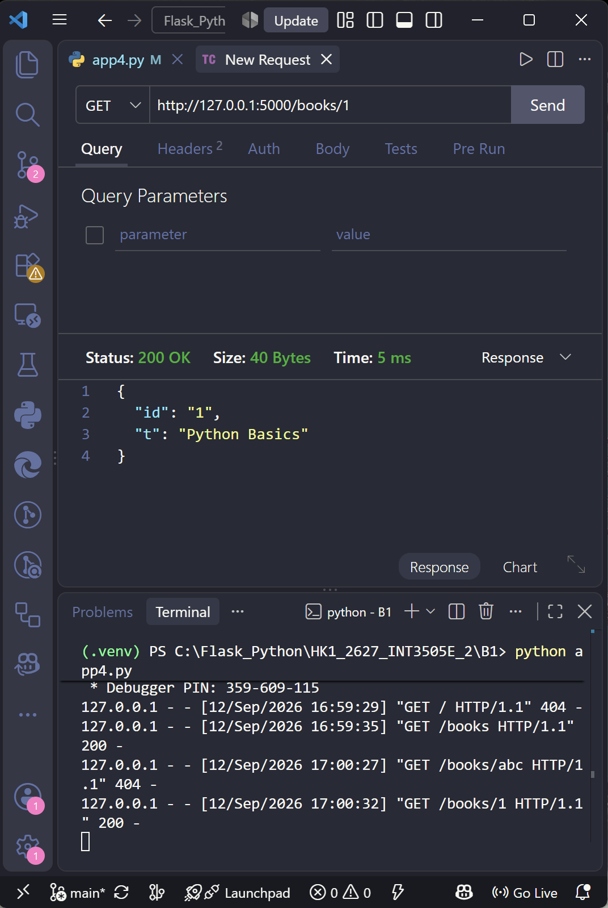
    </td>
    <td align="center">
      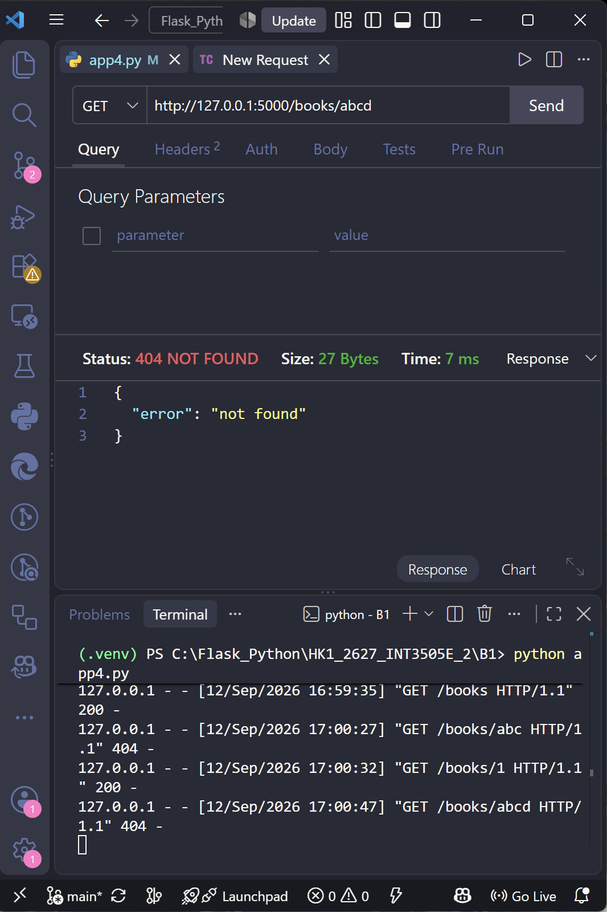
    </td>
  </tr>
  <tr>
    <td width="50%">
      <b>📝 Giải thích ảnh 1:</b> 
      Request <code>GET /books/1</code> hợp lệ; response trả về <code>200 OK</code> cùng thông tin sách có id <code>1</code>.
    </td>
    <td width="50%">
      <b>📝 Giải thích ảnh 2:</b> 
      Request <code>GET /books/abcd</code> không tìm thấy sách; response trả về <code>404 Not Found</code>.
    </td>
  </tr>

  <tr>
    <td align="center">
      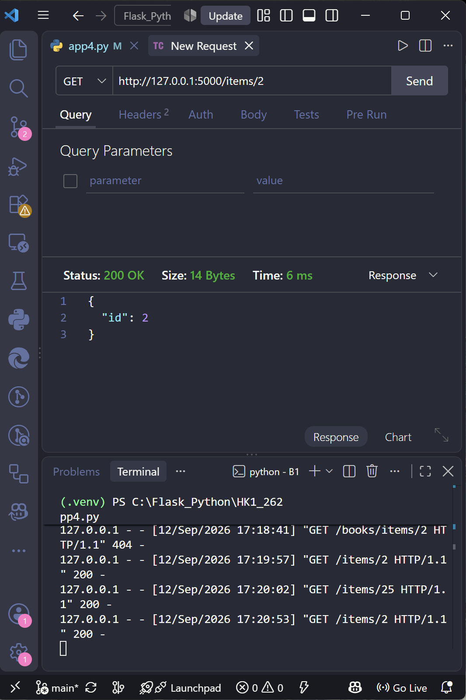
    </td>
    <td align="center">
      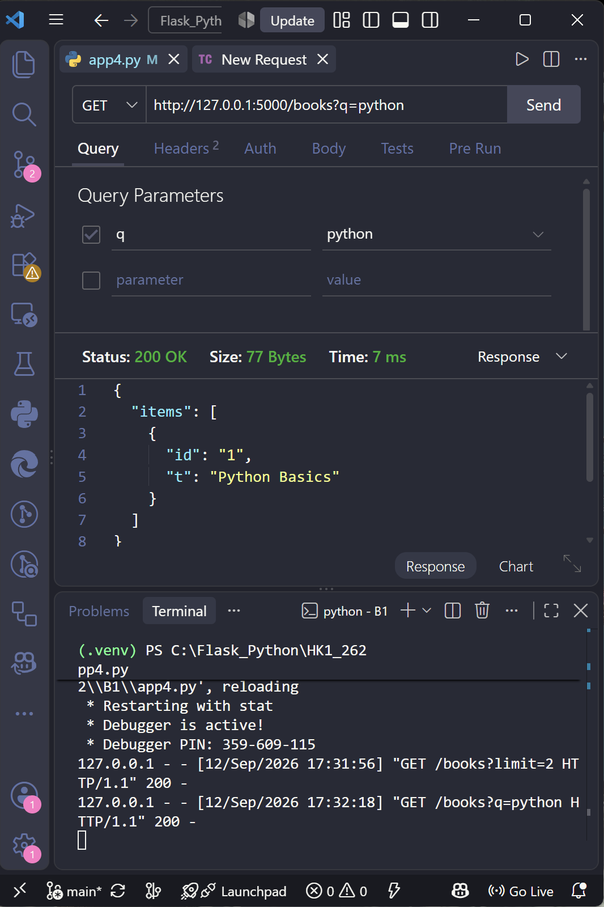
    </td>
  </tr>
  <tr>
    <td width="50%">
      <b>📝 Giải thích ảnh 3:</b> 
      Request <code>GET /items/2</code> sử dụng path parameter; response trả về <code>200 OK</code> với id <code>2</code>.
    </td>
    <td width="50%">
      <b>📝 Giải thích ảnh 4:</b> 
      Request <code>GET /books?q=python</code> sử dụng query string để lọc sách; response trả về <code>200 OK</code> với sách có tiêu đề chứa <code>Python</code>
    </td>
  </tr>
</table>

---

## 5. Bài 5

<table>
  <tr>
    <td align="center">
      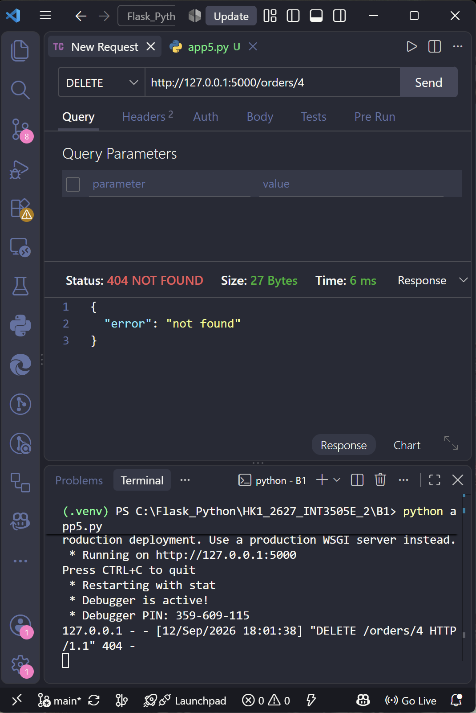
    </td>
    <td align="center">
      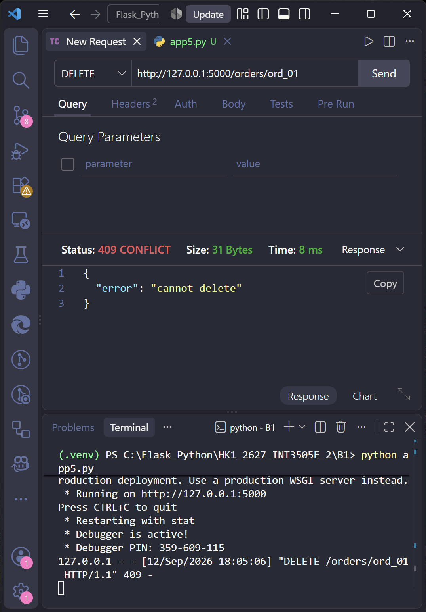
    </td>
  </tr>
  <tr>
    <td width="50%">
      <b>📝 Giải thích ảnh 1:</b> 
      Request <code>DELETE /orders/4</code> không tìm thấy đơn hàng; response trả về <code>404 Not Found</code>.
    </td>
    <td width="50%">
      <b>📝 Giải thích ảnh 2:</b> 
      Request <code>DELETE /orders/ord_01</code> không thể xoá do status đơn hàng không hợp lệ; response trả về <code>409 Conflict</code> và thông báo <code>error:"cannot delete"</code>
    </td>
  </tr>

  <tr>
    <td align="center" colspan="2">
      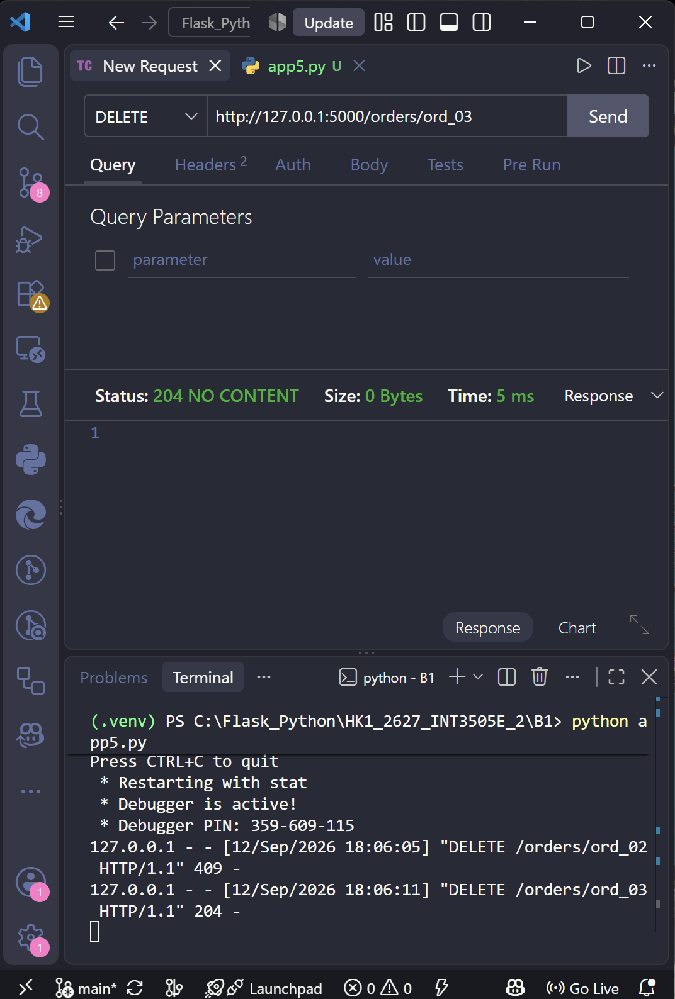
    </td>
  </tr>
  <tr>
    <td colspan="2">
      <b>📝 Giải thích ảnh 3:</b> 
      Request <code>DELETE /orders/ord_03</code> thành công vì status của đơn hàng hợp lệ để xóa; response trả về <code>204 No Content</code>, không có dữ liệu phản hồi.
    </td>
  </tr>
</table>

---

## 6. Bài 6

<table>
  <tr>
    <td align="center">
      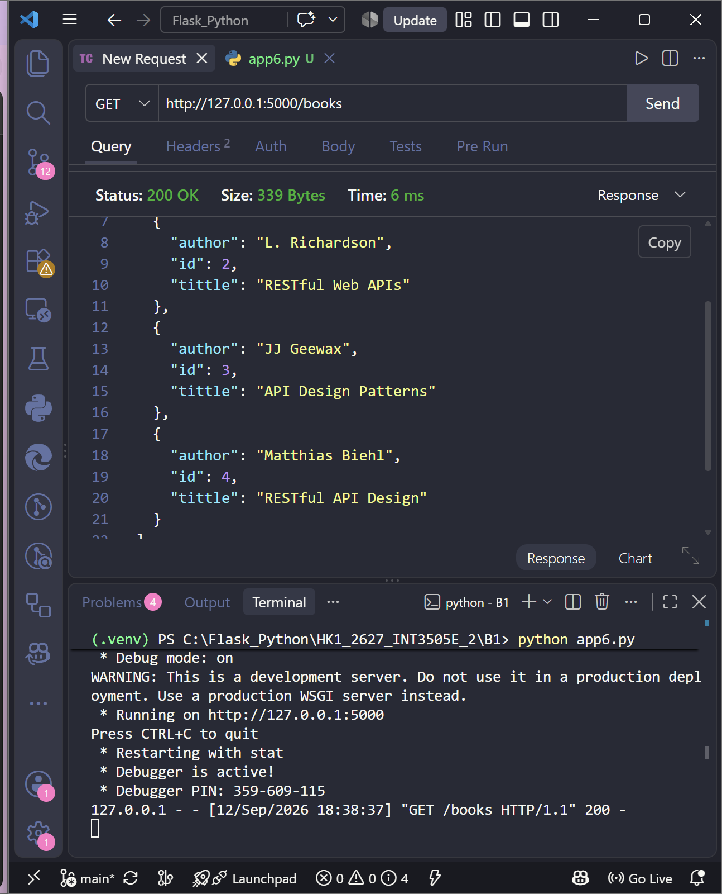
    </td>
    <td align="center">
      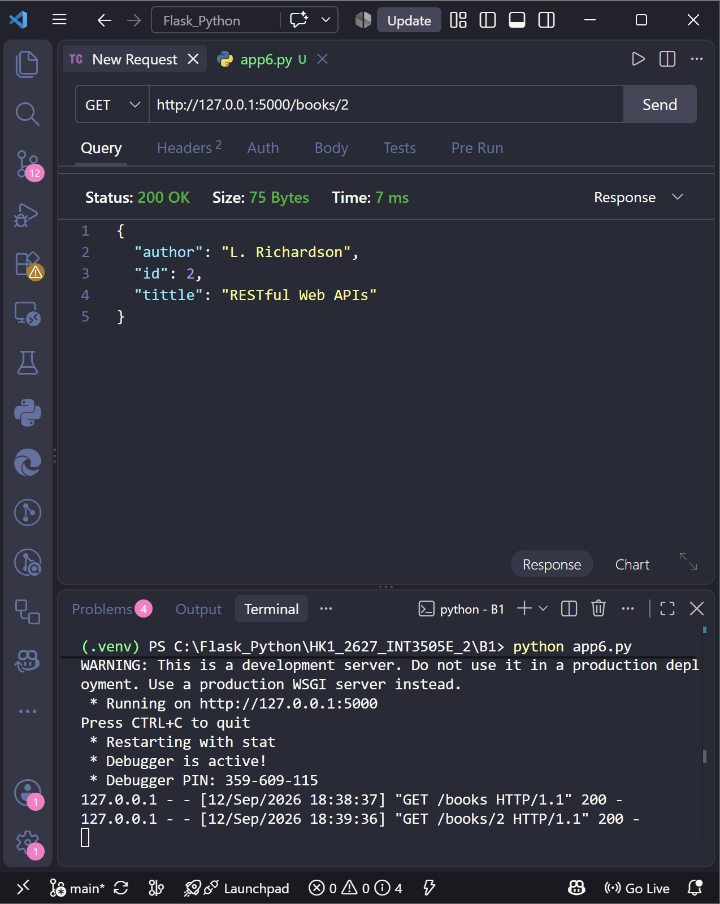
    </td>
  </tr>
  <tr>
    <td width="50%">
      <b>📝 Giải thích ảnh 1:</b> 
      Request <code>GET /books</code> thành công; response trả về <code>200 OK</code> cùng danh sách các sách.
    </td>
    <td width="50%">
      <b>📝 Giải thích ảnh 2:</b> 
      Request <code>GET /books/2</code> thành công; response trả về <code>200 OK</code> cùng thông tin sách có id <code>2</code>.
    </td>
  </tr>

  <tr>
    <td align="center">
      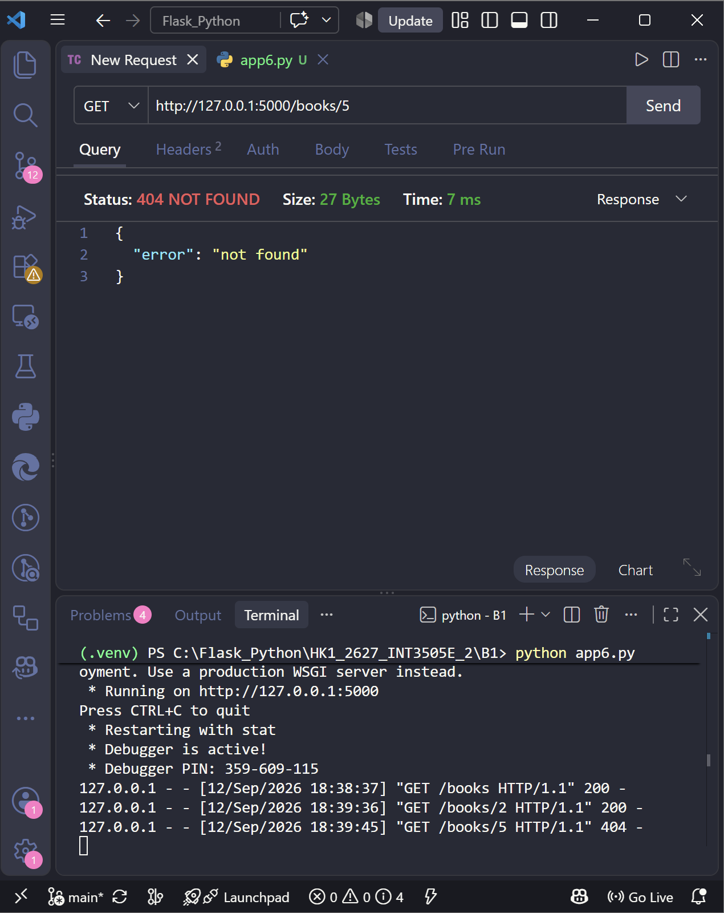
    </td>
    <td align="center">
      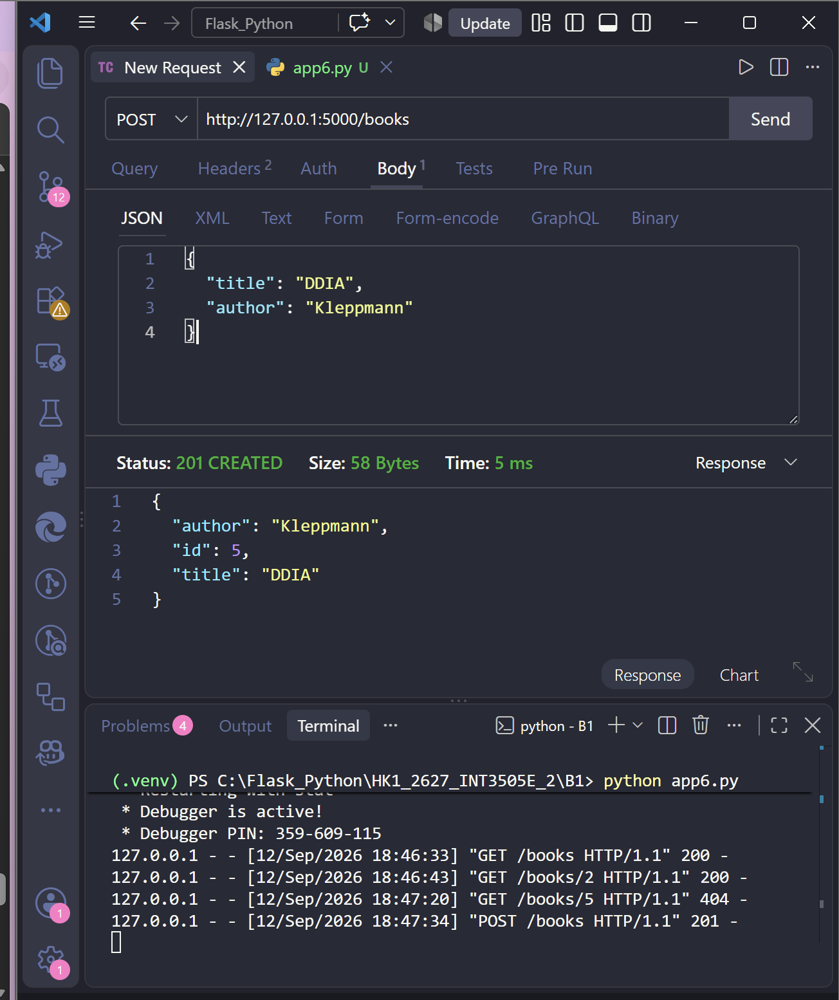
    </td>
  </tr>
  <tr>
    <td width="50%">
      <b>📝 Giải thích ảnh 3:</b> 
      Request <code>GET /books/5</code> không tìm thấy sách; response trả về <code>404 Not Found</code>.
    </td>
    <td width="50%">
      <b>📝 Giải thích ảnh 4:</b> 
      Request <code>POST /books</code> có dữ liệu hợp lệ; response trả về <code>201 Created</code> cùng thông tin sách vừa tạo.
    </td>
  </tr>

  <tr>
    <td align="center">
      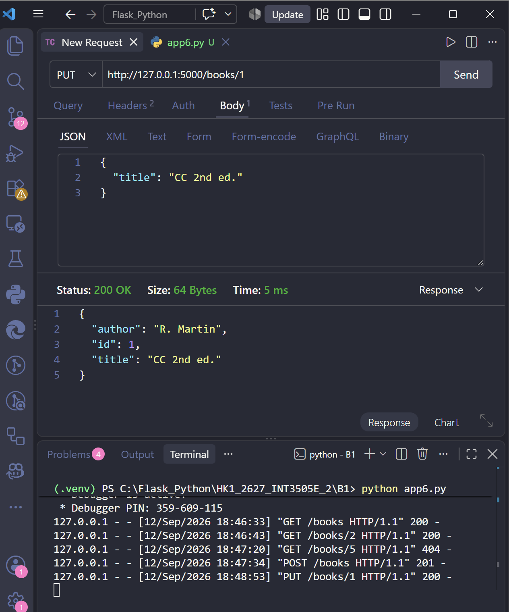
    </td>
    <td align="center">
      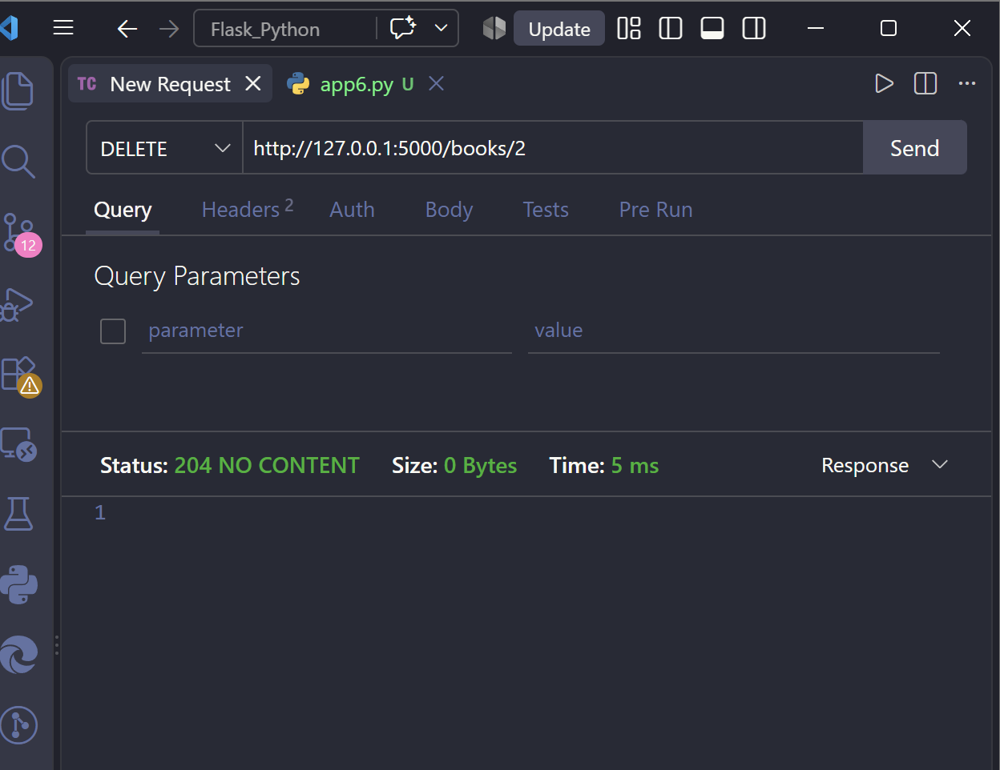
    </td>
  </tr>
  <tr>
    <td width="50%">
      <b>📝 Giải thích ảnh 5:</b> 
      Request <code>PUT /books/1</code> cập nhật tiêu đề sách thành công; response trả về <code>200 OK</code> cùng dữ liệu sách đã cập nhật.
    </td>
    <td width="50%">
      <b>📝 Giải thích ảnh 6:</b> 
      Request <code>DELETE /books/2</code> xoá sách thành công; response trả về <code>204 No Content</code>, không có dữ liệu phản hồi.
    </td>
  </tr>

  <tr>
    <td align="center" colspan="2">
      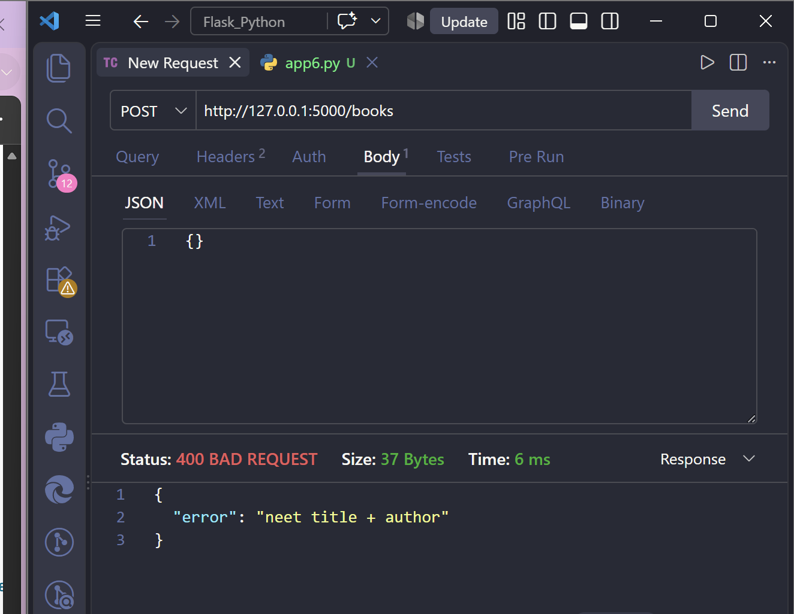
    </td>
  </tr>
  <tr>
    <td colspan="2">
      <b>📝 Giải thích ảnh 7:</b> 
      Request <code>POST /books</code> thiếu dữ liệu bắt buộc; response trả về <code>400 Bad Request</code> với thông báo <code>"need title + author"</code>.
    </td>
  </tr>
</table>