# Kết quả thực hành

## 1. Bài 1

<table>
  <tr>
    <td align="center">
      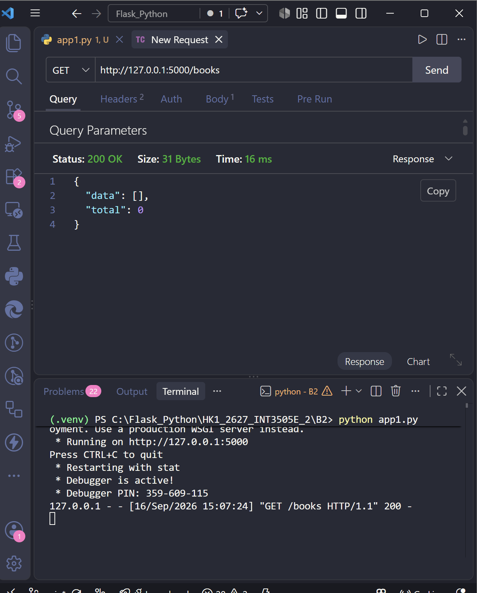
    </td>
    <td align="center">
      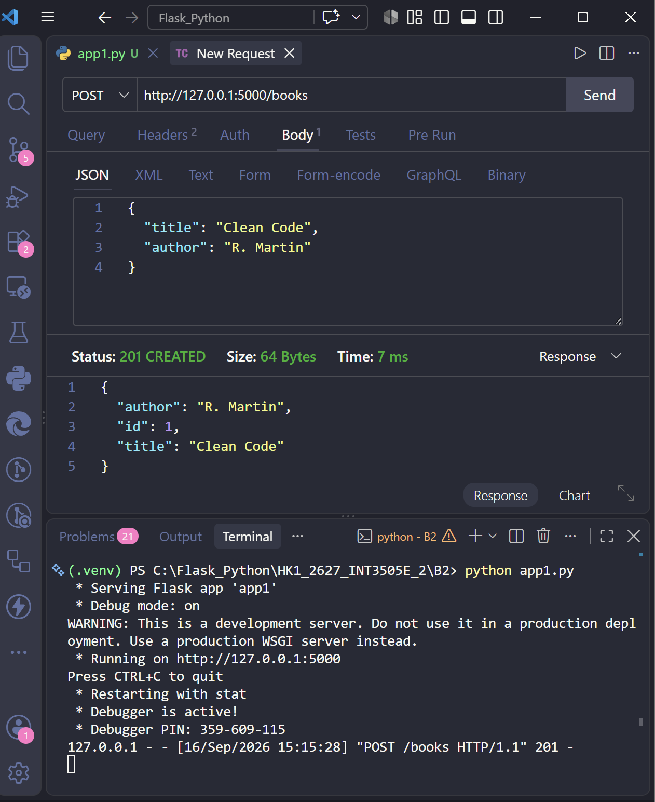
    </td>
  </tr> 
  <tr>
    <td width="50%">
      <b>📝 Giải thích ảnh 1:</b> 
      Request <code>GET /books</code> thành công; response trả về
      <code>200 OK</code> với danh sách sách rỗng và <code>total: 0</code>.
    </td>
    <td width="50%">
      <b>📝 Giải thích ảnh 2:</b> 
      Request <code>POST /books</code> chứa đầy đủ <code>title</code> và
      <code>author</code>; response trả về <code>201 Created</code> cùng
      thông tin sách vừa được tạo.
    </td>
  </tr>

  <tr>
    <td align="center">
      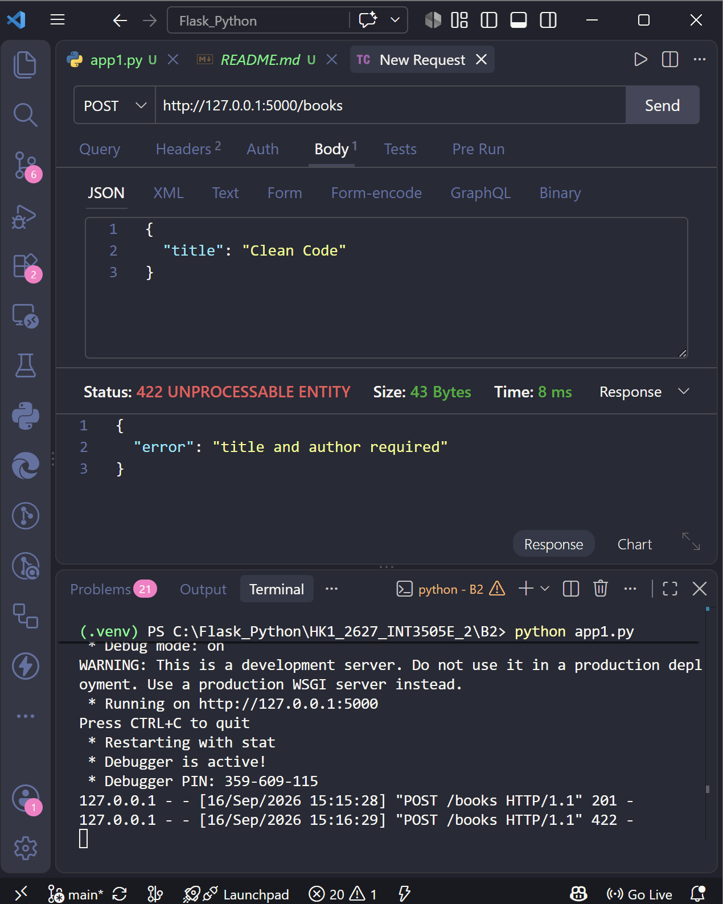
    </td>
    <td align="center">
      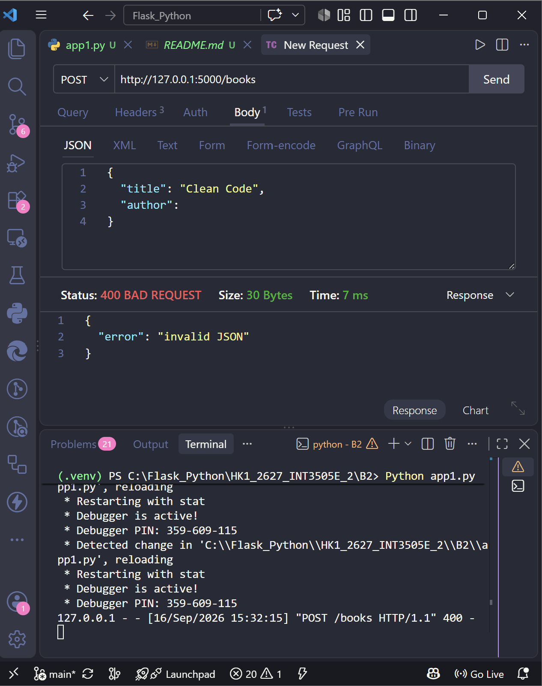
    </td>
  </tr>
  <tr>
    <td width="50%">
      <b>📝 Giải thích ảnh 3:</b> 
      Request <code>POST /books</code> thiếu trường <code>author</code>;
      response trả về <code>422 Unprocessable Entity</code> với thông báo
      <code>"title and author required"</code>.
    </td>
    <td width="50%">
      <b>📝 Giải thích ảnh 4:</b> 
      Request <code>POST /books</code> chứa JSON không hợp lệ; response trả về
      <code>400 Bad Request</code> với thông báo <code>"invalid JSON"</code>.
    </td>
  </tr>

  <tr>
    <td align="center" colspan="2">
      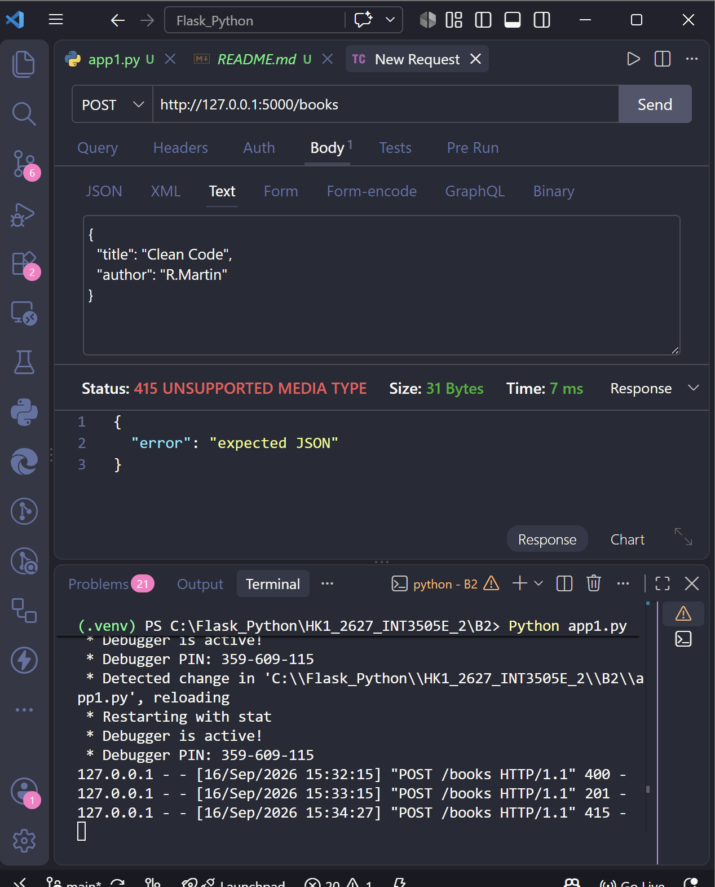
    </td>
  </tr>
  <tr>
    <td colspan="2">
      <b>📝 Giải thích ảnh 5:</b> 
      Request <code>POST /books</code> gửi dữ liệu không đúng định dạng JSON;
      response trả về <code>415 Unsupported Media Type</code> với thông báo
      <code>"expected JSON"</code>.
    </td>
  </tr>
</table>

---

## 2. Bài 2

<table>
  <tr>
    <td align="center">
      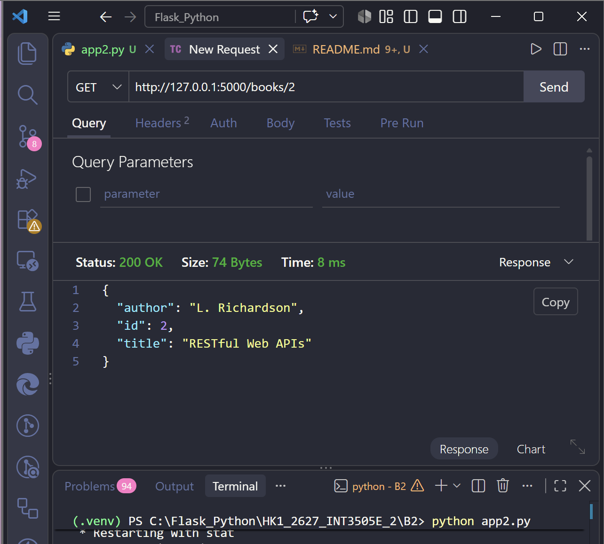
    </td>
    <td align="center">
      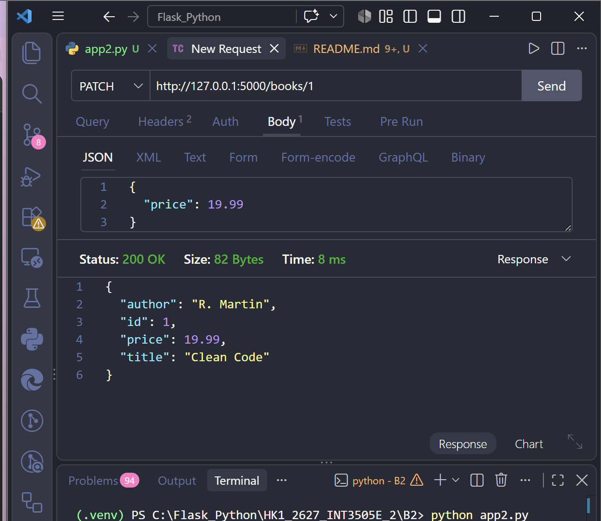
    </td>
  </tr>
  <tr>
    <td width="50%">
      <b>📝 Giải thích ảnh 1:</b> 
      Request <code>GET /books/2</code> lấy thông tin sách thành công;
      response trả về <code>200 OK</code> cùng dữ liệu của sách có id
      <code>2</code>.
    </td>
    <td width="50%">
      <b>📝 Giải thích ảnh 2:</b> 
      Request <code>PATCH /books/1</code> chỉ cập nhật trường <code>price</code>
      mà vẫn giữ nguyên <code>title</code> và <code>author</code>. Response trả về
      <code>200 OK</code> cùng dữ liệu sách sau khi cập nhật một phần.
    </td>
  </tr>

  <tr>
    <td align="center">
      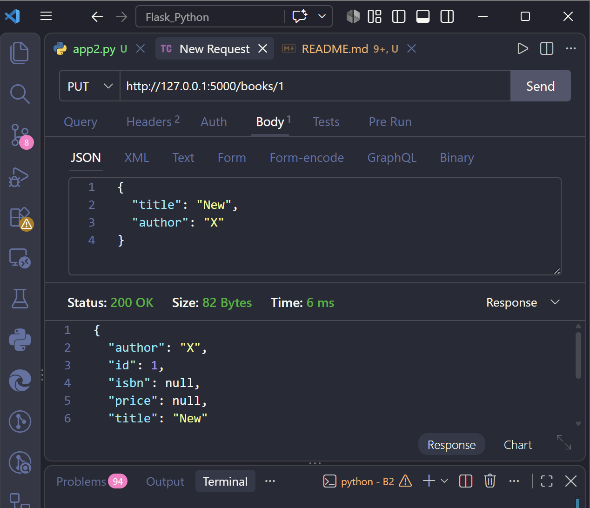
    </td>
    <td align="center">
      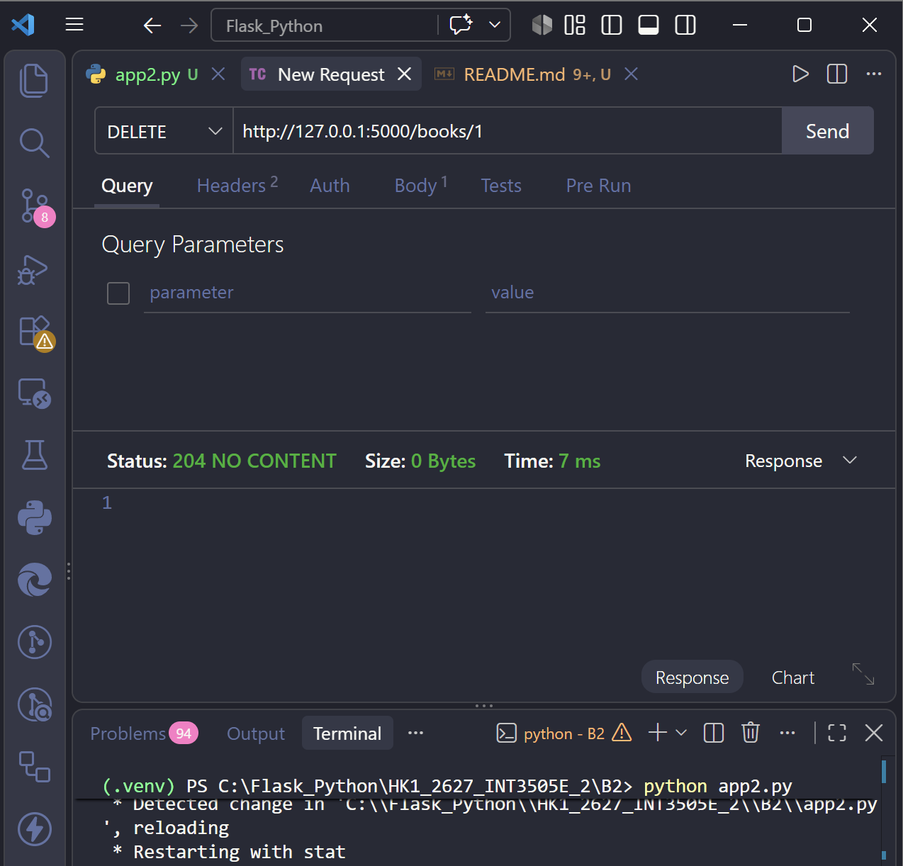
    </td>
  </tr>
  <tr>
    <td width="50%">
      <b>📝 Giải thích ảnh 3:</b> 
      Request <code>PUT /books/1</code> cập nhật toàn bộ thông tin của sách có id
      <code>1</code> bằng dữ liệu mới gồm <code>title</code> và <code>author</code>.
      Response trả về <code>200 OK</code> cùng resource sau khi được cập nhật; khác
      với <code>PATCH</code>, <code>PUT</code> dùng để thay thế đầy đủ dữ liệu của resource.
    </td>
    <td width="50%">
      <b>📝 Giải thích ảnh 4:</b> 
      Request <code>DELETE /books/1</code> xóa sách thành công; response
      trả về <code>204 No Content</code>, không có dữ liệu phản hồi.
    </td>
  </tr>
</table>

---

## 3. Bài 3

<table>
  <tr>
    <td align="center">
      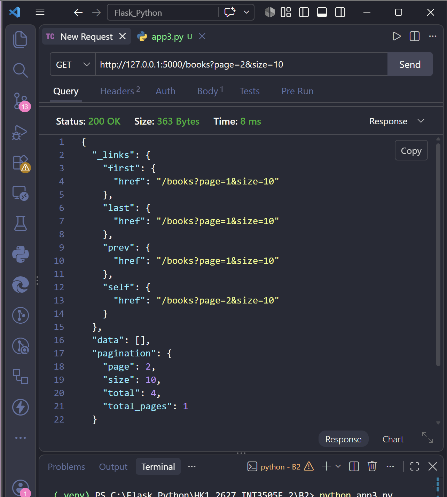
    </td>
    <td align="center">
      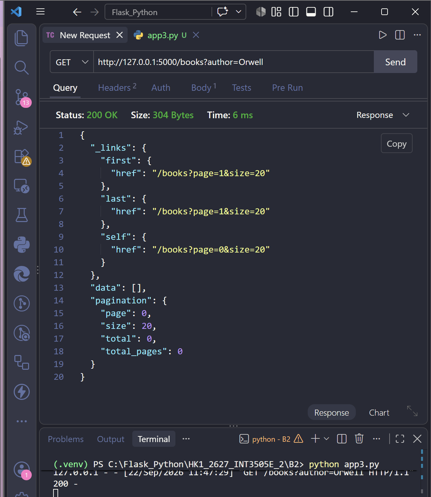
    </td>
  </tr>
  <tr>
    <td width="50%">
      <b>📝 Giải thích ảnh 1:</b> 
      Request <code>GET /books?page=2&amp;size=10</code> được xử lý thành công với
      response <code>200 OK</code>. Kết quả trả về <code>data</code> rỗng vì tổng
      cộng chỉ có 4 sách, tương ứng với 1 trang khi kích thước mỗi trang là 10.
      Response cũng cung cấp các HATEOAS link như <code>first</code>,
      <code>last</code> và <code>prev</code>.
    </td>
    <td width="50%">
      <b>📝 Giải thích ảnh 2:</b> 
      Request <code>GET /books?author=Orwell</code> dùng query string để lọc sách
      theo tác giả. Response trả về <code>200 OK</code> nhưng <code>data</code>
      rỗng vì không có sách nào có tác giả là <code>Orwell</code>.
    </td>
  </tr>

  <tr>
    <td align="center">
      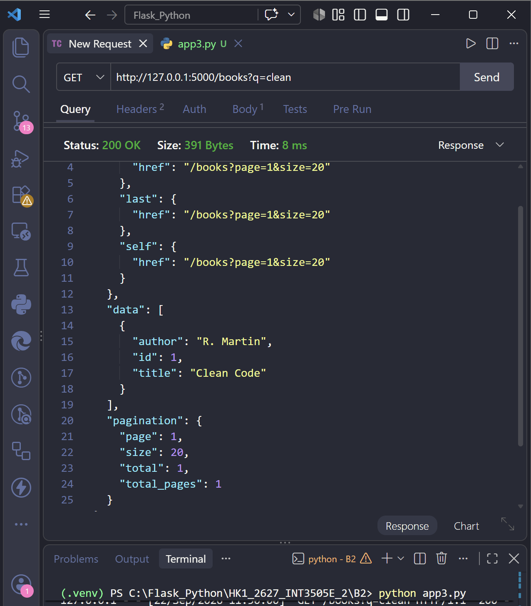
    </td>
    <td align="center">
      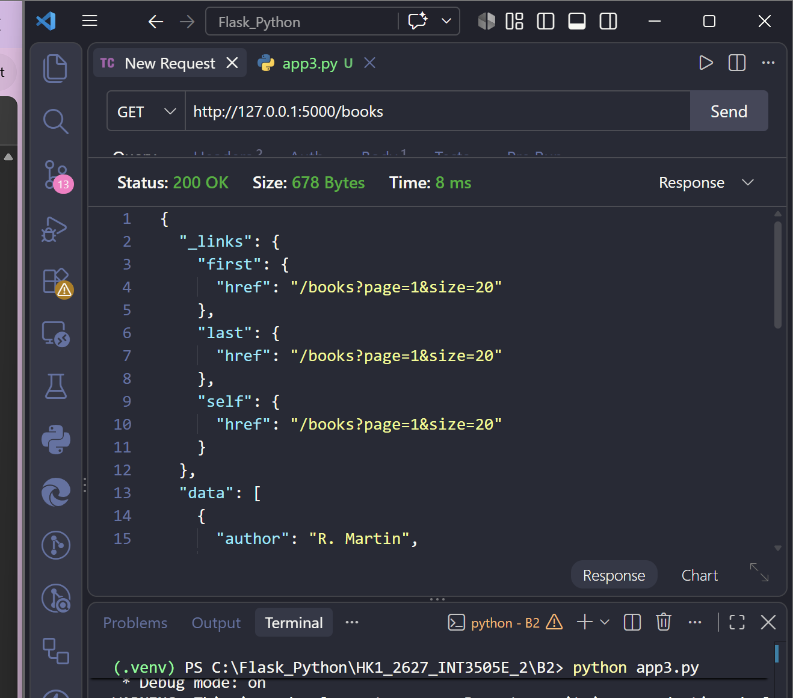
    </td>
  </tr>
  <tr>
    <td width="50%">
      <b>📝 Giải thích ảnh 3:</b> 
      Request <code>GET /books?q=clean</code> dùng query string để tìm từ khóa
      <code>clean</code> trong tiêu đề sách. Response trả về <code>200 OK</code>
      và tìm thấy sách <code>Clean Code</code>.
    </td>
    <td width="50%">
      <b>📝 Giải thích ảnh 4:</b> 
      Request <code>GET /books</code> lấy danh sách sách mặc định thành công.
      Response trả về <code>200 OK</code> cùng dữ liệu sách, thông tin phân trang
      và các HATEOAS link <code>self</code>, <code>first</code> và <code>last</code>.
    </td>
  </tr>
</table>
