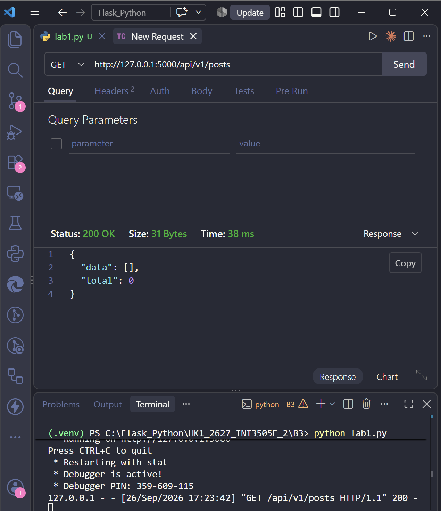
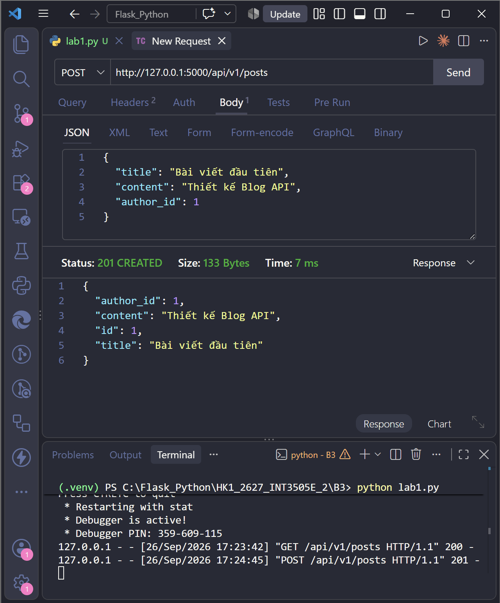
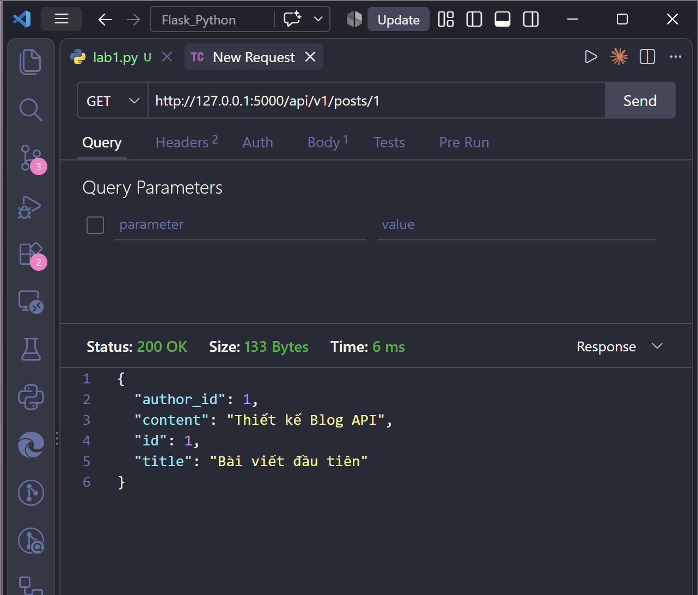
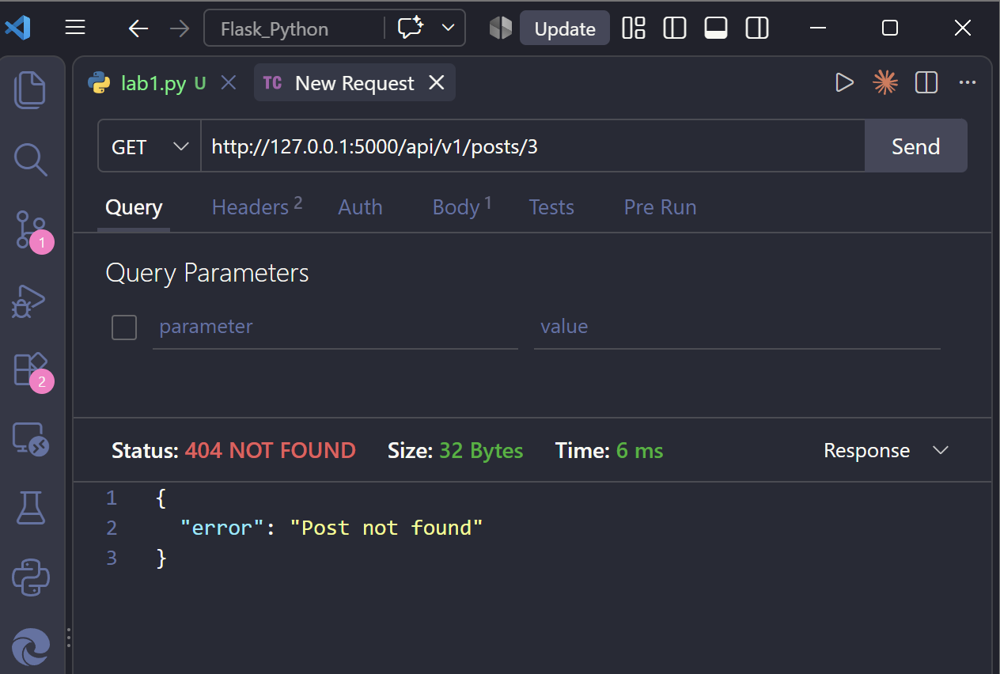

# Kết quả thực hành

## 1. Bài 1

<table>
  <tr>
    <td align="center">
      
    </td>
    <td align="center">
      
    </td>
  </tr> 
  <tr>
    <td width="50%">
      <b>📝 Giải thích ảnh 1:</b> 
      Client gửi request <code>GET /api/v1/posts</code> để lấy danh sách bài viết. Server xử lý thành công và trả về response <code>200 OK</code>. Vì chưa có bài viết nào trong bộ nhớ nên <code>data</code> là danh sách rỗng và <code>total</code> có giá trị bằng <code>0</code>.
    </td>
    <td width="50%">
      <b>📝 Giải thích ảnh 2:</b> 
      Client gửi request <code>POST /api/v1/posts</code> với body JSON hợp lệ, gồm các trường <code>title</code>, <code>content</code> và <code>author_id</code>. Server tạo thành công bài viết mới, tự sinh <code>id: 1</code> và trả về response <code>201 Created</code> cùng dữ liệu của bài viết vừa tạo.
    </td>
  </tr>

  <tr>
    <td align="center">
      
    </td>
    <td align="center">
      
    </td>
  </tr>
  <tr>
    <td width="50%">
      <b>📝 Giải thích ảnh 3:</b> 
      Client gửi request <code>GET /api/v1/posts/1</code> để lấy bài viết có <code>id: 1</code>. Vì bài viết đã được tạo thành công ở request trước, server tìm thấy dữ liệu và trả về response <code>200 OK</code> cùng các thông tin <code>author_id</code>, <code>content</code>, <code>id</code> và <code>title</code>.
    </td>
    <td width="50%">
      <b>📝 Giải thích ảnh 4:</b> 
      Client gửi request <code>GET /api/v1/posts/3</code> để lấy bài viết có <code>id: 3</code>. Vì chưa có bài viết nào mang ID này, server không tìm thấy resource và trả về response <code>404 Not Found</code> với thông báo <code>"Post not found"</code>.
    </td>
  </tr>
  
---