# Kết quả thực hành

## 1. Lab 1

<table>
  <tr>
    <td align="center">
      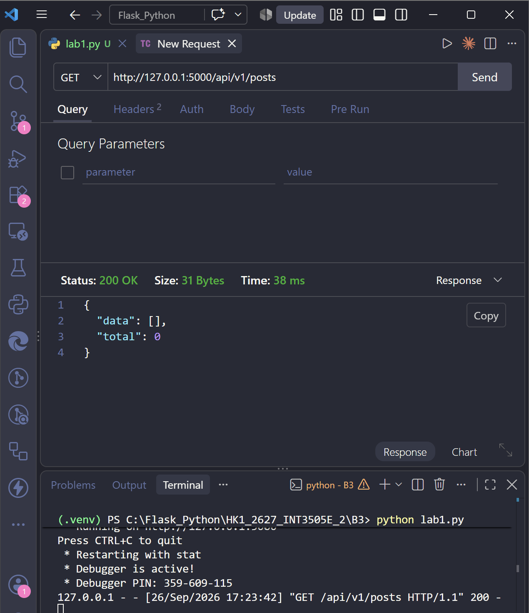
    </td>
    <td align="center">
      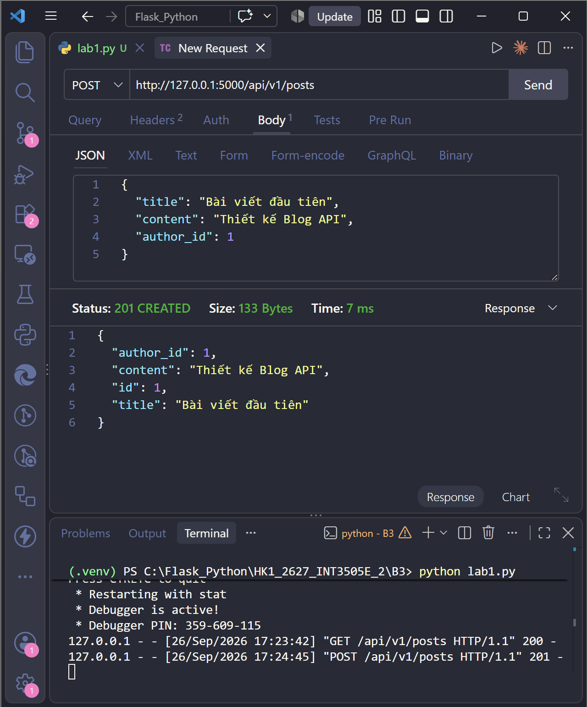
    </td>
  </tr> 
  <tr>
    <td width="50%">
      <b>📝 Giải thích ảnh 1:</b> 
      Client gửi request <code>GET /api/v1/posts</code> để lấy danh sách bài viết. Server xử lý thành công và trả về response <code>200 OK</code>. Vì chưa có bài viết nào trong bộ nhớ nên <code>data</code> là danh sách rỗng và <code>total</code> có giá trị bằng <code>0</code>.
    </td>
    <td width="50%">
      <b>📝 Giải thích ảnh 2:</b> 
      Client gửi request <code>POST /api/v1/posts</code> với body JSON hợp lệ, gồm các trường <code>title</code>, <code>content</code> và <code>author_id</code>. Server tạo thành công bài viết mới, tự sinh <code>id: 1</code> và trả về response <code>201 Created</code> cùng dữ liệu của bài viết vừa tạo.
    </td>
  </tr>

  <tr>
    <td align="center">
      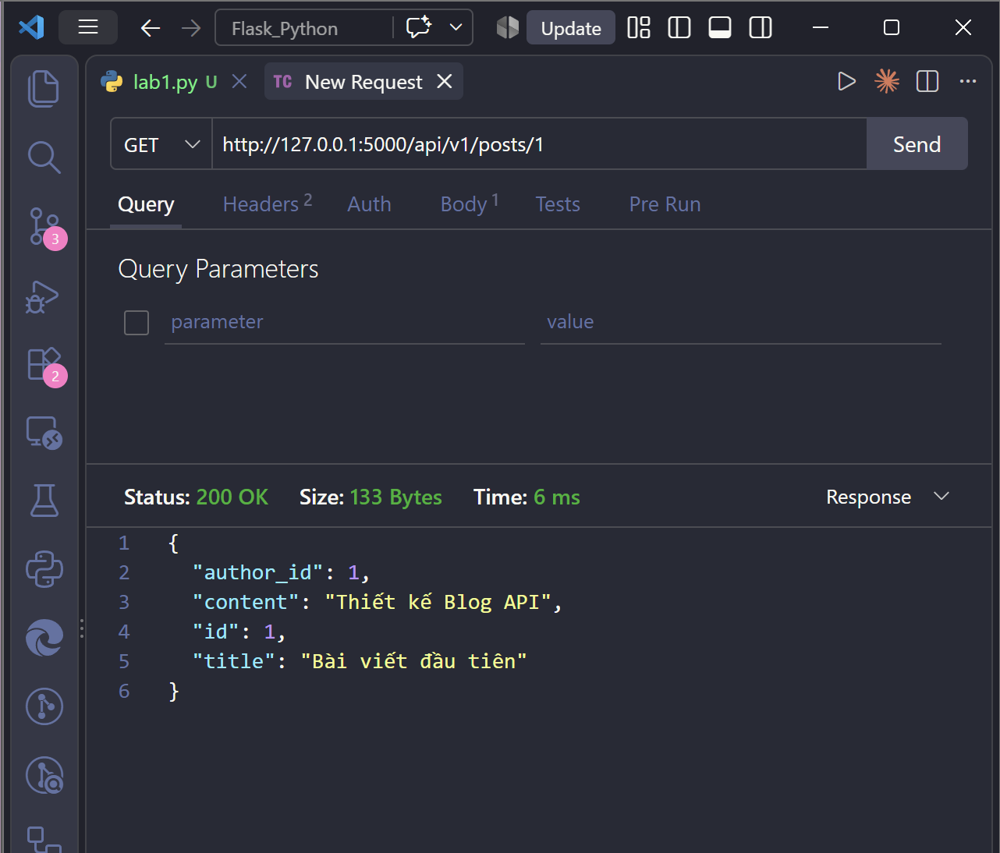
    </td>
    <td align="center">
      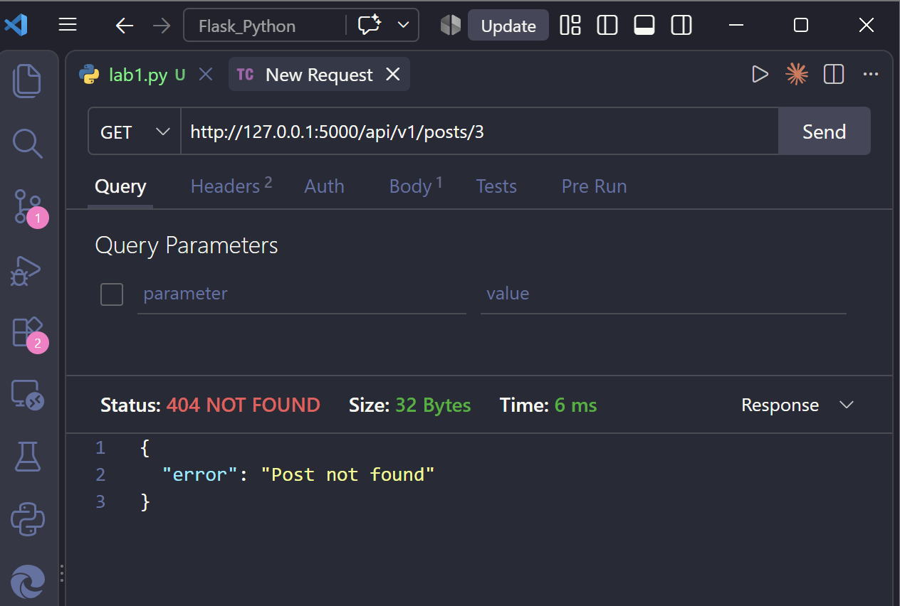
    </td>
  </tr>
  <tr>
    <td width="50%">
      <b>📝 Giải thích ảnh 3:</b> 
      Client gửi request <code>GET /api/v1/posts/1</code> để lấy bài viết có <code>id: 1</code>. Vì bài viết đã được tạo thành công ở request trước, server tìm thấy dữ liệu và trả về response <code>200 OK</code> cùng các thông tin <code>author_id</code>, <code>content</code>, <code>id</code> và <code>title</code>.
    </td>
    <td width="50%">
      <b>📝 Giải thích ảnh 4:</b> 
      Client gửi request <code>GET /api/v1/posts/3</code> để lấy bài viết có <code>id: 3</code>. Vì chưa có bài viết nào mang ID này, server không tìm thấy resource và trả về response <code>404 Not Found</code> với thông báo <code>"Post not found"</code>.
    </td>
  </tr>
</table>

---

## 2. Lab 2

<table>
  <tr>
    <td align="center">
      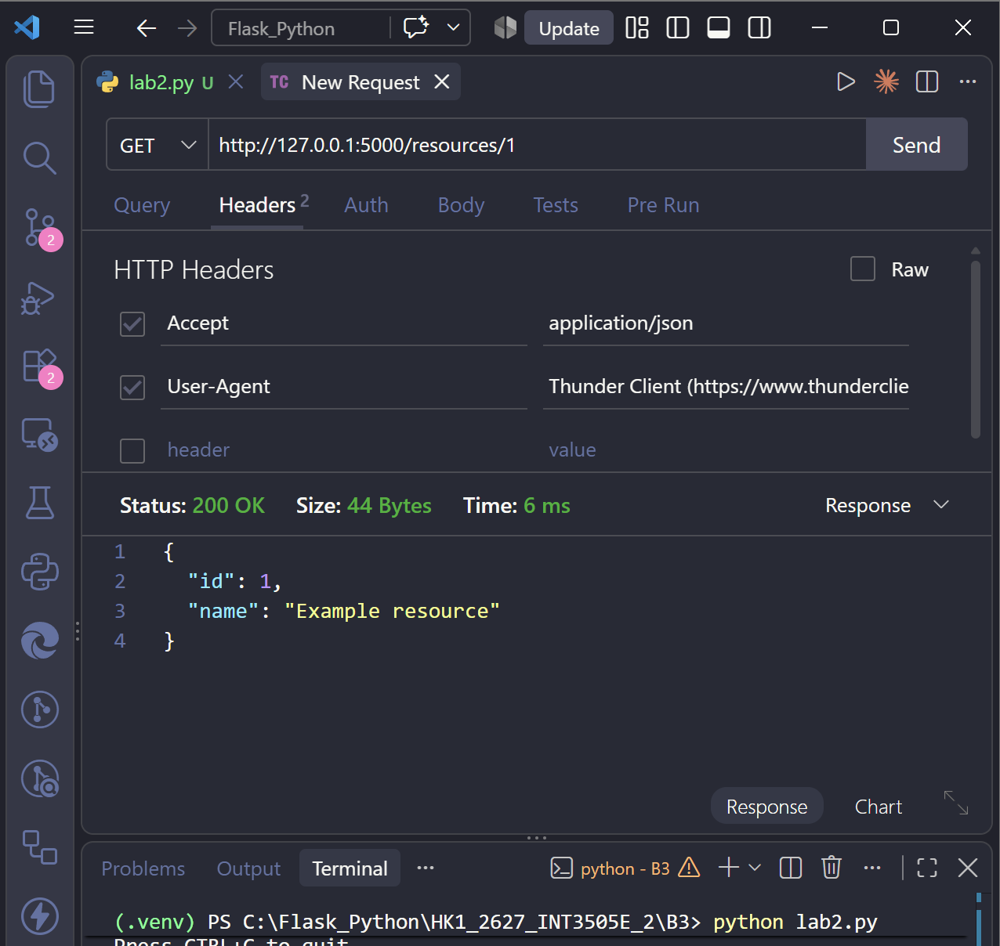
    </td>
    <td align="center">
      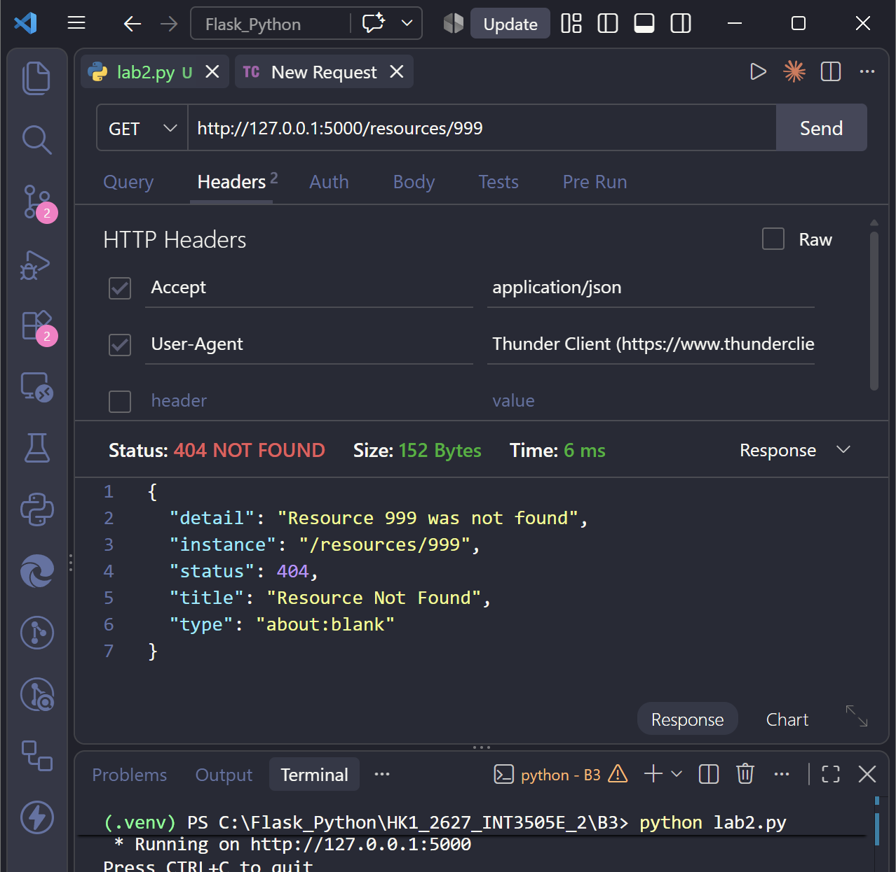
    </td>
  </tr> 
  <tr>
    <td width="50%">
      <b>📝 Giải thích ảnh 1:</b> 
      Client gửi request <code>GET /resources/1</code>. Resource có ID <code>1</code> tồn tại nên server xử lý thành công và trả về response <code>200 OK</code>. Body chứa thông tin của resource gồm <code>id</code> và <code>name</code>. Đây là trường hợp request hợp lệ, không phát sinh lỗi nên response là JSON dữ liệu thông thường.
    </td>
    <td width="50%">
      <b>📝 Giải thích ảnh 2:</b> 
      Client gửi request <code>GET /resources/999</code>. Server không tìm thấy resource có ID <code>999</code> nên route chủ động phát sinh <code>ProblemError</code>. Error handler chuyển lỗi thành response <code>404 Not Found</code> với các trường <code>type</code>, <code>title</code>, <code>detail</code>, <code>status</code> và <code>instance</code>. Trường <code>instance</code> cho biết lỗi xảy ra tại đường dẫn <code>/resources/999</code>.
    </td>
  </tr>

  <tr>
    <td align="center">
      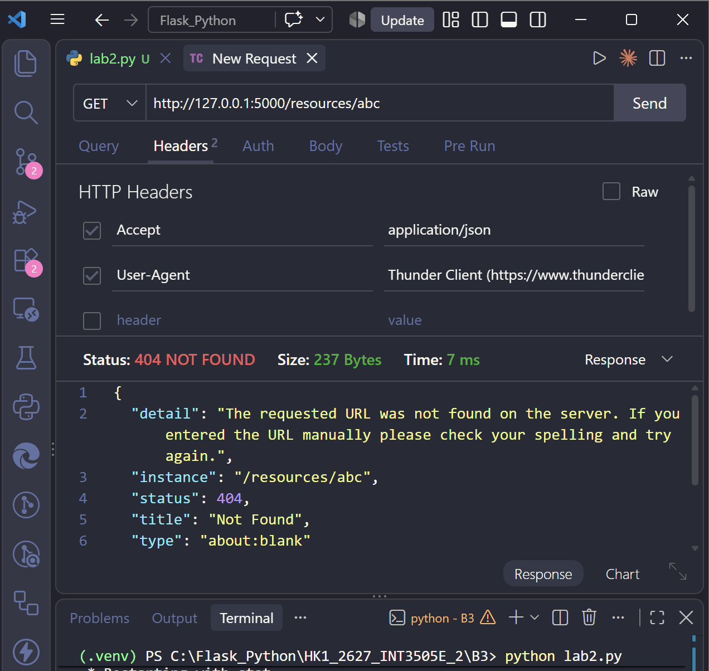
    </td>
    <td align="center">
      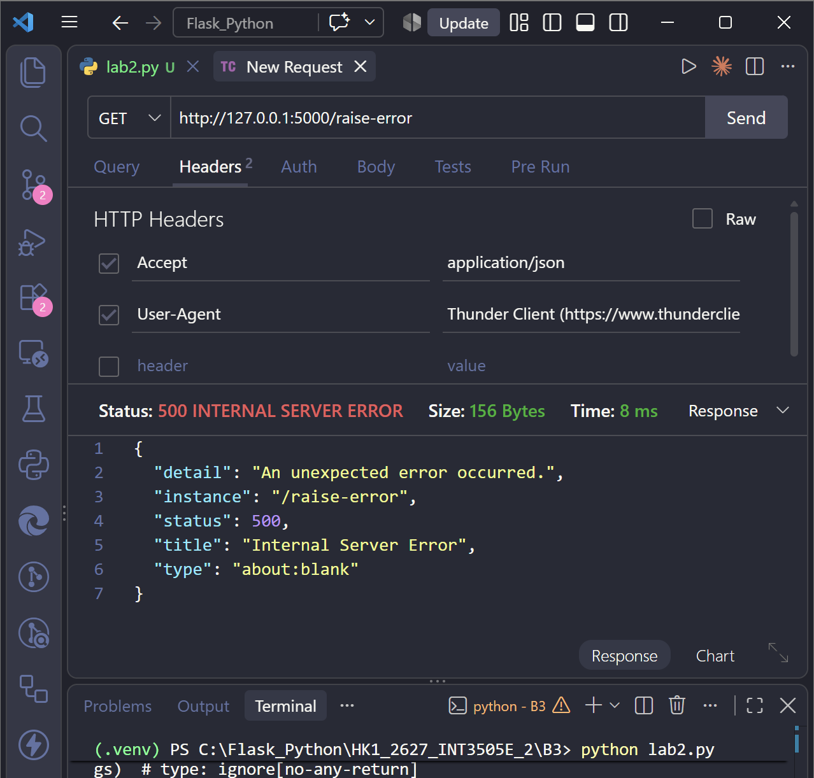
    </td>
  </tr>
  <tr>
    <td width="50%">
      <b>📝 Giải thích ảnh 3:</b> 
      Client gửi request <code>GET /resources/abc</code>. URL này không khớp với route đã khai báo vì tham số resource được định nghĩa là số nguyên. Flask phát sinh lỗi HTTP <code>404 Not Found</code>, sau đó handler dành cho <code>HTTPException</code> chuyển lỗi sang cùng định dạng <code>problem+json</code>. 
    </td>
    <td width="50%">
      <b>📝 Giải thích ảnh 4:</b> 
      Client gửi request <code>GET /raise-error</code>. Route cố ý phát sinh một exception ngoài dự kiến, nên fallback handler xử lý và trả về response <code>500 Internal Server Error</code>. Client chỉ nhận thông báo trung tính <code>"An unexpected error occurred."</code>, không nhìn thấy stack trace hoặc chi tiết nội bộ của server. Chi tiết lỗi được ghi ở phía server để phục vụ việc debug.
    </td>
  </tr>
</table>

---

## 2. Lab 3

<table>
  <tr>
    <td align="center">
      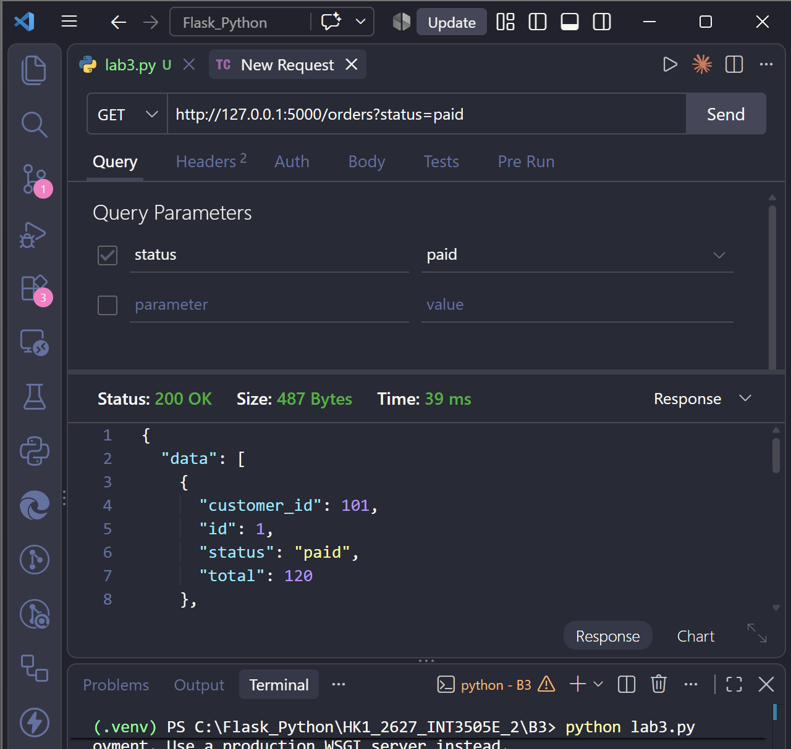
    </td>
    <td align="center">
      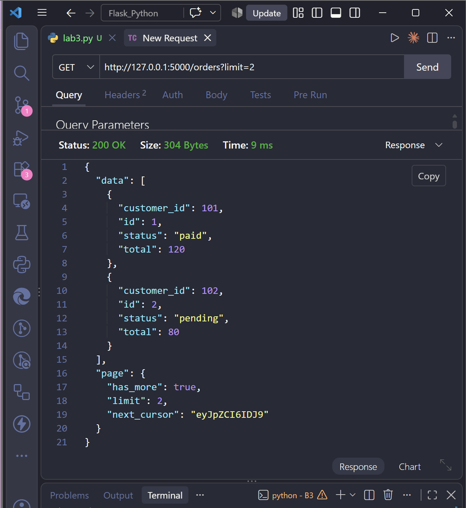
    </td>
  </tr> 
  <tr>
    <td width="50%">
      <b>📝 Giải thích ảnh 1:</b> 
      Request <code>GET /orders?status=paid</code> lọc các đơn hàng có
      trạng thái <code>paid</code>. Response trả về <code>200 OK</code>;
      danh sách <code>data</code> chỉ chứa những đơn hàng thỏa mãn
      điều kiện lọc.
    </td>
    <td width="50%">
      <b>📝 Giải thích ảnh 2:</b> 
      Request <code>GET /orders?limit=2</code> trả về hai đơn hàng đầu tiên,
      có ID <code>1</code> và <code>2</code>. Response trả về
      <code>200 OK</code>; <code>has_more: true</code> cho biết còn dữ liệu,
      còn <code>next_cursor</code> được dùng để lấy trang tiếp theo.
    </td>
  </tr>

  <tr>
    <td align="center">
      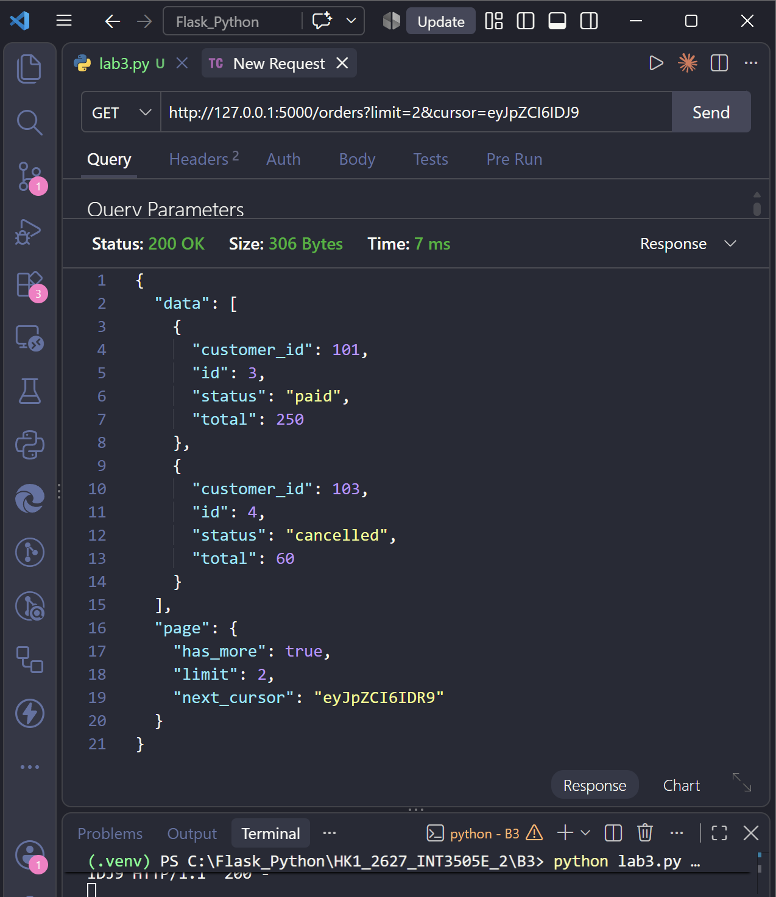
    </td>
    <td align="center">
      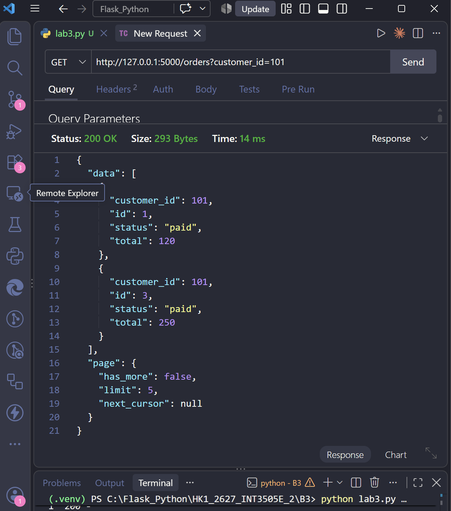
    </td>
  </tr>
  <tr>
    <td width="50%">
      <b>📝 Giải thích ảnh 3:</b> 
      Request <code>GET /orders?limit=2&amp;cursor=eyJpZCI6IDJ9</code>
      dùng <code>next_cursor</code> nhận được ở ảnh 2. Response trả về
      <code>200 OK</code> với hai đơn hàng tiếp theo, có ID <code>3</code>
      và <code>4</code>. Server tiếp tục trả <code>next_cursor</code> mới
      vì <code>has_more: true</code>.
    </td>
    <td width="50%">
      <b>📝 Giải thích ảnh 4:</b> 
      Request <code>GET /orders?customer_id=101</code> lọc đơn hàng theo
      khách hàng có ID <code>101</code>. Response trả về <code>200 OK</code>
      với hai đơn hàng có ID <code>1</code> và <code>3</code>.
      <code>has_more: false</code> và <code>next_cursor: null</code>
      cho biết không còn trang tiếp theo.
    </td>
  </tr>

  <tr>
    <td align="center">
      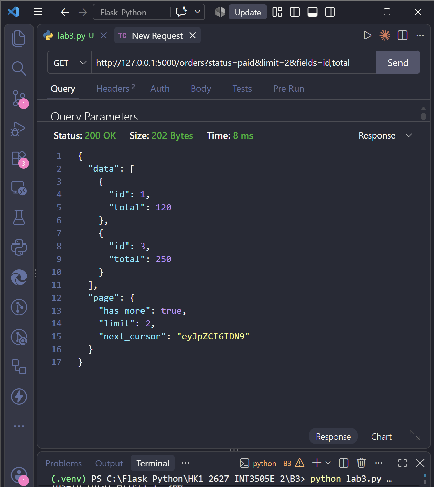
    </td>
    <td align="center">
      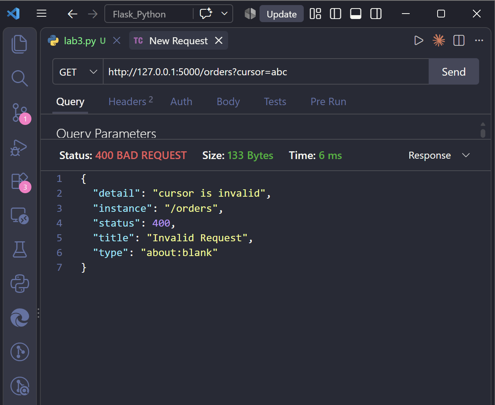
    </td>
  </tr> 
  <tr>
    <td width="50%">
      <b>📝 Giải thích ảnh 5:</b> 
      Request <code>GET /orders?status=paid&amp;limit=2&amp;fields=id,total</code>
      kết hợp lọc trạng thái, giới hạn hai kết quả và chọn trường dữ liệu.
      Response trả về <code>200 OK</code> với hai đơn hàng có ID
      <code>1</code> và <code>3</code>; mỗi đơn hàng chỉ hiển thị
      <code>id</code> và <code>total</code>.
    </td>
    <td width="50%">
      <b>📝 Giải thích ảnh 6:</b> 
      Request <code>GET /orders?cursor=abc</code> sử dụng cursor không hợp lệ.
      Server từ chối request và trả về <code>400 Bad Request</code>
      với thông báo <code>"cursor is invalid"</code>.
    </td>
  </tr>
</table>